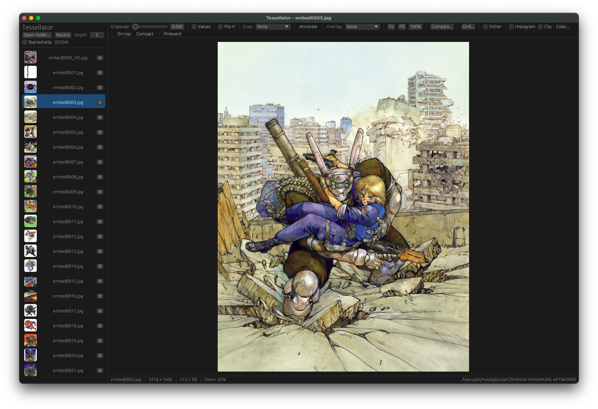

# Tessellator

A high-performance photo viewer for artists, built in Rust on `eframe` + WGPU.

Designed for the "flip rapidly through a folder of references" workflow, with extras for visual analysis: composition overlays, A/B compare, magnifier loupe, eyedropper, value-study, annotation paint-over, and a moodboard canvas.



## Features

- **Fast browsing.** Folder list with thumbnails, source dimensions, keyboard navigation, neighbor preload, and an LRU image cache so flipping back and forth is instant.
- **GPU-accelerated viewport.** WGPU with mipmaps and trilinear filtering. Smooth zoom-to-cursor and drag-to-pan.
- **Fit / Fill / 100% / arbitrary zoom.** One-key access via `F`, `Shift+F`, `1`.
- **Composition overlays.** Rule of thirds, golden ratio, diagonal cross, custom grid - all with adjustable opacity.
- **A/B compare.** Pick a second image; drag the divider (slider or directly on the image) to reveal one over the other at the same zoom and pan.
- **Grid compare (A/B/C/D).** Pick 2-4 images and view them side-by-side (1xN strip or 2x2 grid), each aspect-fitted in its tile, sharing a single zoom + pan.
- **Loupe / magnifier.** Hold `Alt` to get a circular magnifier centered on the cursor.
- **Eyedropper.** Hovering shows the exact RGB / hex of the pixel under the cursor in the status bar.
- **Drag-and-drop.** Drop a folder (or any image) onto the window to open.
- **Live folder watching.** Files added or removed externally appear in the list within ~500 ms.
- **Grayscale slider.** Useful for value studies.
- **Value study mode.** Posterize to 2-8 luma bands to check light/dark structure.
- **Flip horizontal.** One-key mirror to spot composition issues.
- **Crop preview.** Overlay the framing for square, 4:5, 16:9, or golden-rectangle ratios.
- **Annotation layer.** Toggle on, then drag to paint over the image (color picker + brush size + eraser). Strokes auto-save to a sidecar PNG (`photo.jpg.tess.png`) next to the original and reload when you revisit the image.
- **Stars / favourites.** Mark images as favourites (sidecar JSON `photo.jpg.tess.json`); filter the sidebar to "starred only" with one click.
- **Reference mode.** Always-on-top + borderless window so the viewer floats above your painting app. Pair with Compact mode to hide all panels for a chrome-free reference image.
- **Pinboard / moodboard.** Pin multiple images on a 2D canvas, drag to arrange, drag corners to resize uniformly, scroll to zoom the whole board. Session-only (no save/load yet).
- **Histogram overlay.** RGB + luminance, computed once per image, drawn on the viewport.
- **Color palette extraction.** 8 dominant colors per image via median cut, click a swatch to copy its hex code.
- **Split-toning preview.** Cinematic teal/orange by default; pick custom shadow + highlight tints.
- **Clipping warning.** Magenta over blown highlights, cyan over crushed shadows.
- **EXIF orientation.** Phone photos display upright.
- **Persistence.** Last folder, panel sizes, and tool settings restore on launch.
- **Quick-tool icon bar.** Top of the Settings window: one-click toggles for value study, crop, export, annotate, reference mode, color panel, compare, EXIF, grid, and pinboard.
- **Branding.** App/window icon, an About window, launch art shown before a folder is opened, and (macOS) a menu-bar icon with show/hide/quit.

## Build & run

Requires a recent stable Rust toolchain (edition 2024).

```sh
cargo run --release
```

Debug builds work but image decoding is much slower; use release for realistic feel.

To enable verbose logging:

```sh
RUST_LOG=debug cargo run --release
```

### Install on macOS (Finder "Open With")

To install Tessellator as a real `.app` and register it as an image handler so
you can right-click an image and choose **Open With -> Tessellator**:

```sh
./scripts/install-macos.sh
```

This builds release, assembles `Tessellator.app` (icon + `Info.plist` with file
associations for JPEG, PNG, TIFF, BMP, WebP, JPEG 2000, and comic archives
`.cbz`/`.cbr`), installs it to
`/Applications` (or `~/Applications` if that isn't writable), ad-hoc signs it,
and registers it with Launch Services. To make it the default viewer: Get Info
on an image, set "Open with" to Tessellator, and click "Change All".

Opening a file (via Finder, `open -a Tessellator photo.jpg`, or
`tessellator photo.jpg`) opens that image's folder and selects it. On macOS,
"Open With" is delivered to the app delegate's `application:openURLs:`. winit
owns the delegate and doesn't implement that method, so `src/macos_open.rs`
adds it to winit's delegate class at runtime - during an
`applicationWillFinishLaunching` notification, the one moment after winit has
set its delegate but before AppKit dispatches the launch document. On
Windows/Linux the path arrives via argv.

The bundle icon comes from `assets/Tessellator.icns`. To regenerate it after
changing `assets/app_icon.png`, build an `.iconset` of the standard sizes and
run `iconutil -c icns`. (`cargo bundle` also produces a basic `.app` but cannot
emit the file associations, which is why the script hand-builds the bundle.)

## Keyboard shortcuts

### Navigation

| Key | Action |
|---|---|
| `Left` / `Right` | Previous / next image |
| `Space` | Next image (alias) |
| `Home` / `End` | First / last image |
| `PageUp` / `PageDown` | Jump 10 images |

### View

| Key | Action |
|---|---|
| `F` or `0` | Fit image to viewport |
| `Shift+F` | Fill viewport (may crop) |
| `1` | 100% (native pixel size) |
| `=` or `+` | Zoom in 10% |
| `-` | Zoom out 10% |
| `Alt` (held) | Show magnifier loupe under cursor |

### Tools

| Key | Action |
|---|---|
| `G` | Toggle grayscale (full color ↔ full B&W) |
| `H` | Flip horizontal (mirror displayed image) |
| `V` | Toggle value study (posterized grayscale) |
| `A` | Toggle annotation mode (drag paints) |
| `S` | Toggle star on the current image |
| `Shift+S` | Filter sidebar to starred images only |
| `T` | Always-on-top + borderless (reference mode) |
| `\` | Compact (hide all panels - just the image) |
| `P` | Toggle pinboard / moodboard mode |
| `B` | Pin currently-selected image to the board |
| `Delete` / `Backspace` | Remove the selected pinboard item |
| `R` | Rotate the displayed image 90° clockwise (Shift+R for ccw) |
| `Cmd+Delete` / `Cmd+Backspace` | Send the current image to the OS trash |
| `Esc` | Clear compare mode |

### App

| Key | Action |
|---|---|
| `Cmd+O` / `Ctrl+O` | Open folder picker |
| `Cmd+R` / `Ctrl+R` | Re-scan current folder (preserves selection) |
| `Cmd+C` / `Ctrl+C` | Copy current image's path to clipboard |

The sidebar's "Recent" button shows the last few folders you've opened.

## Mouse

In the single-image viewport:

| Action | Effect |
|---|---|
| Scroll | Zoom in/out around cursor |
| Drag | Pan |
| Drag near compare divider | Move the A/B split point |
| Drag while annotation mode is on | Paint a stroke |
| Hover | Eyedropper (status bar) |
| `Alt`-hover | Magnifier loupe |

In pinboard mode:

| Action | Effect |
|---|---|
| Scroll | Zoom canvas around cursor |
| Drag empty space | Pan canvas |
| Drag a tile | Move it (raises to top of z-stack) |
| Drag a tile's corner | Resize, aspect-locked |

## Sidecar files

Tessellator stores per-image metadata next to the original file so the originals are never modified and the metadata syncs naturally with cloud / backup tools:

| File | Purpose |
|---|---|
| `photo.jpg.tess.png` | Annotation layer (transparent PNG, same dimensions as the source) |
| `photo.jpg.tess.json` | Star / tag metadata (presence-based for now) |

Erasing every stroke or clicking the **Clear** button deletes the annotation sidecar; un-starring deletes the JSON sidecar. No empty files left behind.

## Supported formats

JPEG, PNG, WebP, BMP, TIFF (driven by the `image` crate), and JPEG 2000
(`.jp2`, `.j2k`, `.jpf`, `.jpx`, `.j2c`, `.jpc`) via the pure-Rust `jpeg2k`
(`openjp2`) decoder.

Comic archives: `.cbz` (ZIP, via the pure-Rust `zip` crate) and `.cbr` (RAR,
via the bundled `unrar` C library). Open one (Finder "Open With", drag-and-drop,
or a recent entry) and its image pages are extracted to a temp folder and shown
in archive order, navigable like any folder of images. Archives are *entered*
on open - they don't appear as entries inside regular folder listings.

## Configuration

Recursion depth for folder scanning is exposed in the sidebar (default `2`, max `16`). Other settings live in the tools panel and persist between sessions.

## License

MIT (or whatever you want; this project is unlicensed by default).
